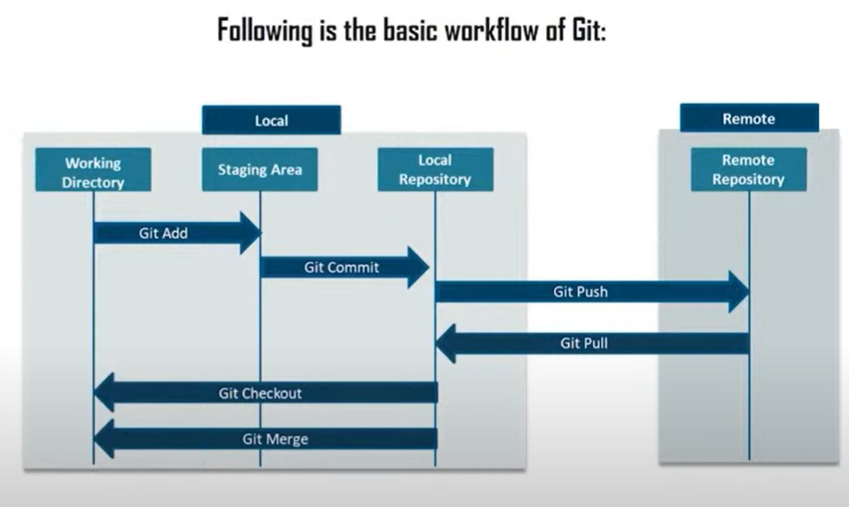
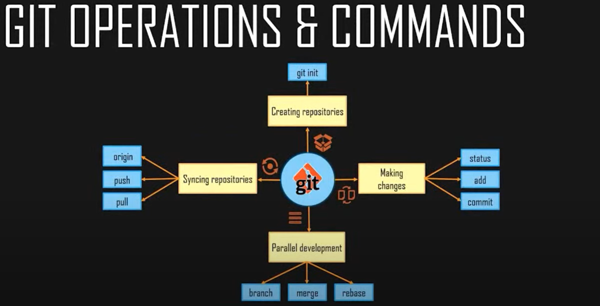

### What is version control?

Version control is a system that **records changes to a file or a set of files over time** so that you can recall specific version later. These versions are **recorded in a repository** and can be recalled from the same. There are **Local, Centralized and Distributed** version control systems.(distributed workflow -> local repo's -> remote repo -> server where code is deployed)

### Why version control is needed?

- Helps the deveopers to easily collaborate in shared workspaces and access real time updates
- History of code modifications is saved
- Allows to rollback, reverse faulty update, reduce downtime and saves time

### What is a repository?

Storage space where the projects live. Can be a folder on local computer or can be storage space on another online host such as Github. **Github is a web-based git repository hosting service**

### What is Git?

**Git is a Distributed Version Control tool**. It supports distributed non-linear parallel workflows, allows the team of developers work together on same project even remotely and enables them to easily merge their changes into one source.

### Workflow of git

    Developers
    ↓
    Clone → Local Repo
                ↓
                Checkout
                ↓
    Working Local Copy
    ↓
    (Modify Files)
    ↓
    Staging Area ← Stage Changes
    ↓
    Commit Changes to Local Repo
    ↓
    Fetch (Check for Remote Changes)
    ↓
    Pull (Get Remote Changes amd merge) → Rebase (if needed)
    ↓
    Push
    ↓
    Remote Repo

- Clone – Developers clone the remote repository to create a local repository on their machine.
- Local Repository – The cloned repository serves as a working local copy of the project.
- Checkout to get the working directory
- Working Directory – Developers make changes to files in their local working copy.
- Staging Area – Changes are added to the staging area using git add, preparing them for commit.
- Commit – Staged changes are committed to the local repository using git commit.
- Fetch & Pull:
  - Fetch – Retrieves changes from the remote repository without merging them.
  - Pull – Fetches and automatically merges the latest changes from the remote repository.
- Rebase (if needed) – Developers can use git rebase to apply their local commits on top of the latest changes from the remote repository, ensuring a clean commit history.
- Push – Commits are pushed from the local repository to the remote repository using git push

### Requirements

- Download Git bash

### Commands

- <git init>
  Initiates a new empty local git repository. Here, .git will be created.
- <git config --global user.name "yourname">
- <git config --global user.email "yourmailid">
  Configs can be done once. Not needed everytime
- <git config --list>
- <git clone repourl>
  Creates a copy of remote repository on your local machine
- <git fork>
  Creates a copy of remote repository on your github account
- <git remote add origin repolink>
  Eg: <git remote add origin https://github.com/BhavanaMP/gitlearn.git>
  Lets you add or link a remote repository to your created local repository. It creates alias of your remote repo, named as origin, in your local repo.
- <git remote -v>
  Allows us check if the remote repo is linked to our local repo
- <git remote rename origin desiredname>
  Lets us rename the alias origin to your desired name
- <git remote remove branchname> or <git remote rm branchname>
  Removes the remote repository from our local repo
- <git branch>
  Shows which branch you are on currently
- <git branch branchname>
  Eg: <git branch local-dev>
  Creates a new branch in our local repository. It creates a branch from the source repo which we are currently on. So all commits in that source branch is copied to this new branch.
- <git branch -m oldbranchname newbranchname>
  Helps to rename the local repo branch names.
- <git branch -m oldbranchname newbranchname>
  <git push alias :oldbranchname newbranchname>
  Helps to rename the branch name in local repo and pushing it to remote repo renames the branch in the remote repo as well. Note that oldbranchname exists in remote repo.
  Eg: <git branch -m test staging>
  <git push origin :test staging>
- <git branch -d branchname>
  Delete branch from the local repository
- <git checkout branchname>
  Eg: <git checkout  dev>
  Switch to that given existing branch
- <git checkout -b branchname>
  Eg: <git checkout -b dev>
  Allows us to create a new branch with given branch name switch to that new branch
- <git add "filename"> or <git add .>
  To add specified or all files to staging area before comitting
- <git rm --cached "filename">
  To unstage files from staging area
- <git commit -m "message">
  Commits your changes from staging area to your local repository
- <git commit --amend>
- <git stash>
  When we want to save the current changes in the working branch but want to go back to clean working branch. (in case of checkout to another branches)
- <git stash pop>
  Get back the stashed changes
- <git rebase branchnamefromwhichchnagestobereflected>
  Rebase is used when changes made in one existing branch needs to be reflected in another branch. When we created a local branch from master at C2 commit, then we add a new commit C4 to this local branch, meanwhile someone did commit C3 to Master, then we can get those changes reflected in our local branch using rebase, such that it looks like the commits are made sequentially. C1, C2, C3, C4. We essentially changes the base from C2 commit to C3 commit of our branch. Eg: <git rebase master> we essentially rebasing our local branch base from master. Make sure to be on or checkout to the branch of which you want re-base its base.
- <git merge branchnametobemerged>
  Lets us to merge changes from a branch to another branch. Checkout the branch to which you want to merge changes to. Now run the command with branchnametobemerged
  Eg: Our branchnametobemerged is dev. We want to merge this branch changes to test or master. Then we checkout to test or master and run <git merge dev>. This will also copy the commits of the merged branch as it is. Can be checked with git log
- <git cherrypick>
- <git fetch>
- <git push aliasofremoterepo branchname>
  Eg: <git push origin master>, <git push origin dev>
  Lets you push your local changes from your local repo to the remote repo branch. Note that origin is  the alias of remote repo.  Give credentials for remote repo if asked while pushing.
- <git push alias --delete branchname>
  Deletes the branch in the remote repo Eg: <git push origin --delete somebranch>
- <git pull origin master>
  Lets you copy all the files from the master branch of remote repo to your local repo

- <git status>
  Gives the files tracking, history of modifications and stuff
- <git log>
  Gives the commit history along with commit hash id, author, commit message and time of our current branch
- <git log branchname>
  Gives the commit history along with commit hash id, author, commit message and time of our specified branch
- <git log --oneline>
  Shows commits logs in single lines
- <git log branchname --oneline>
  Shows commits logs of a branch in single lines
- <git show commithashid>
  commithashid with first 7 to 8 letters of full commit hash id works. Press q to end.
- <git ls-files>
  Shows the files that are tracked by our local git repo. If new file is created and is not yet added to the staging using git add command, then git can't track that new file. Adding it to staging area helps git to start tracking this new files thereafter.
- <git archive branchname --format=zip -output=../filename.zip>
  Archives any branch from your local repository and save it as zip file that can be shared
- <git bundle create ../repo.bundl>
  Git archive sends only the specified file contents to the standard output. Git bundle creates a single file containing both file contents and history

